# Highly Available Web Application Platform on AWS

Designed and deployed a multi-tier AWS web application platform focused on availability, scalability, network isolation, and repeatable infrastructure. The platform uses a custom VPC, public and private subnet separation, an internet-facing Application Load Balancer, an Auto Scaling Group across two Availability Zones, private EC2 application instances, and a private Amazon RDS database tier.

The architecture was first implemented and verified in the AWS Management Console. This repository codifies the platform with Terraform under `terraform/`, while the screenshots below document the working console deployment.

## Project Goals

- build a highly available web application platform across 2 AZs
- separate internet-facing, application, and database tiers
- implement load balancing and horizontal scaling
- protect the database inside private subnets
- manage the infrastructure with repeatable Terraform
- document the architecture like a real cloud engineering project

## Architecture Overview

The diagram below shows the full AWS deployment, including the VPC, public and private subnet layout, load balancer, Auto Scaling group, RDS database tier, NAT gateways, Route 53, ACM, S3, IAM, and CloudWatch monitoring.

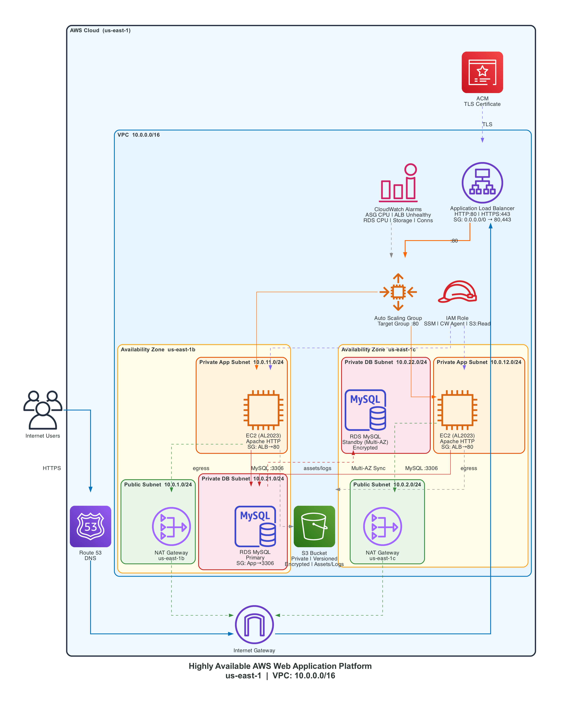

The platform includes:

- **Custom VPC**
- **2 public subnets** for the load balancer and NAT gateways
- **2 private application subnets** for EC2 instances
- **2 private database subnets** for Amazon RDS
- **Internet Gateway**
- **2 NAT Gateways**
- **Application Load Balancer**
- **Auto Scaling Group**
- **EC2 application instances across 2 Availability Zones**
- **Amazon RDS for MySQL**
- **Security groups for ALB, app tier, and DB tier**
- **ACM certificate with DNS validation through Route 53**
- **CloudWatch alarms for compute, load balancer, and database health**
- **S3 bucket for assets, logs, backups, or deployment artifacts**
- **IAM role and instance profile for EC2 access to SSM, CloudWatch, and S3**

Terraform is configured for **us-east-1** and deploys resources across **us-east-1b** and **us-east-1c**.

## Architecture Highlights

- The **Application Load Balancer** serves as the public entry point for the application.
- The **Auto Scaling Group** maintains healthy compute capacity across two Availability Zones.
- The **application tier runs in private subnets**, reducing direct internet exposure.
- The **database tier is isolated in private DB subnets** and only accepts traffic from the application tier.
- **NAT Gateways** provide outbound internet access for private application instances without making them public.
- **HTTPS support** is configured with ACM certificate validation through Route 53.
- **CloudWatch alarms** monitor ASG CPU, unhealthy ALB targets, RDS CPU, free storage, and database connections.

## Terraform Implementation

Terraform under `terraform/` provisions the core infrastructure:

- VPC, internet gateway, public subnets, private application subnets, and private database subnets
- public, private application, and private database route tables
- two NAT Gateways, one per public subnet / Availability Zone
- security groups for the ALB, application tier, and database tier
- Application Load Balancer with HTTP and HTTPS listeners
- target group with HTTP health checks
- EC2 launch template using Amazon Linux 2023 and Apache HTTP Server
- Auto Scaling Group with CPU target tracking
- private Multi-AZ Amazon RDS MySQL instance
- ACM certificate and Route 53 DNS validation records
- CloudWatch metric alarms
- encrypted, private S3 bucket with versioning
- EC2 IAM role and instance profile for SSM, CloudWatch, and S3 read-only access

### Required Terraform Variables

Set these values through `TF_VAR_*` environment variables or a local `.tfvars` file that is not committed:

- `db_master_username`
- `db_master_password`
- `app_domain_name`
- `route53_zone_id`
- `s3_assets_bucket_name`

Optional alarm thresholds and notification actions are also available in `terraform/variables.tf`.

### Terraform Commands

From the `terraform/` directory:

```bash
terraform init
terraform fmt
terraform validate
terraform plan
terraform apply
```

### Deployment Challenge: ACM Certificate Issuance

One of the main issues I faced during this project was the amount of time it took for AWS Certificate Manager to issue the TLS certificate. Even with DNS validation configured through Route 53, certificate provisioning introduced a waiting period before the HTTPS listener could be fully completed and tested.

## Screenshots

These images are from the **AWS console** deployment described above.

### VPC Resource Map
Shows the custom VPC layout, subnet segmentation, route tables, NAT gateways, and internet connectivity design.

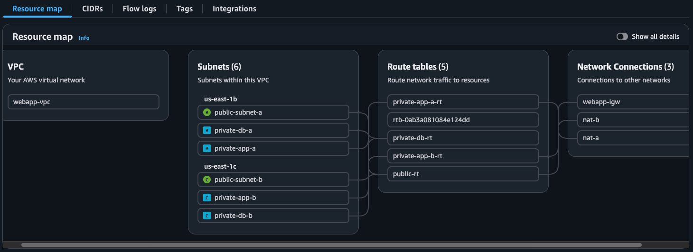

### Route Tables
Shows routing separation between public, private application, and private database subnets.

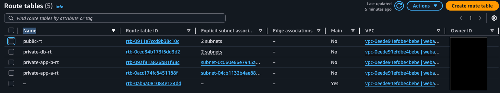

### NAT Gateways
Two NAT Gateways were deployed to support outbound connectivity from private subnets across both Availability Zones.

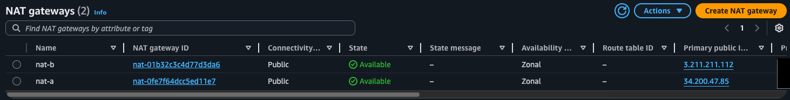

### Security Groups
Separate security groups were created for the load balancer, application tier, and database tier to enforce least-privilege network access.

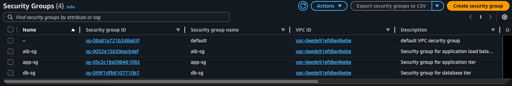

### Application Load Balancer
The ALB is internet-facing and distributed across two public subnets in separate Availability Zones.

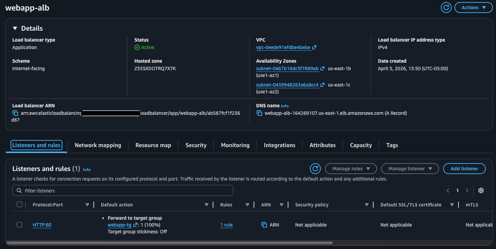

### Target Group Health
The target group shows two healthy EC2 instances actively registered behind the load balancer.

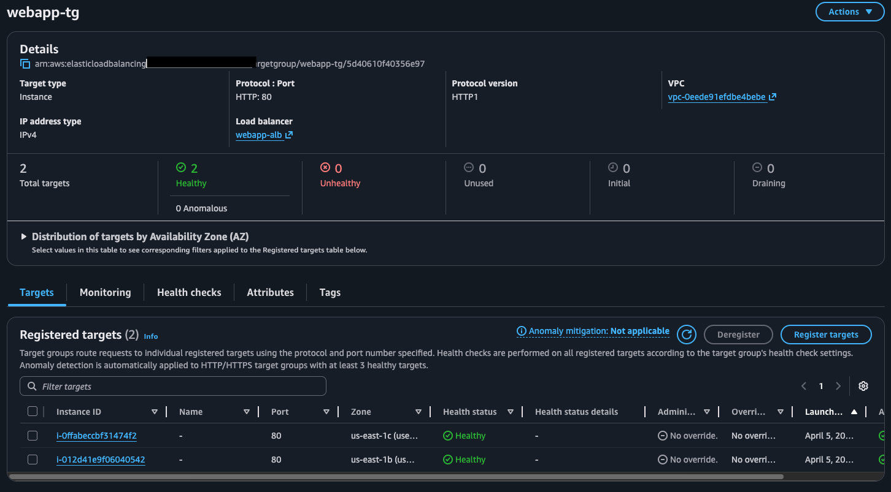

### Auto Scaling Group
The ASG maintains application capacity and distributes instances across multiple Availability Zones.

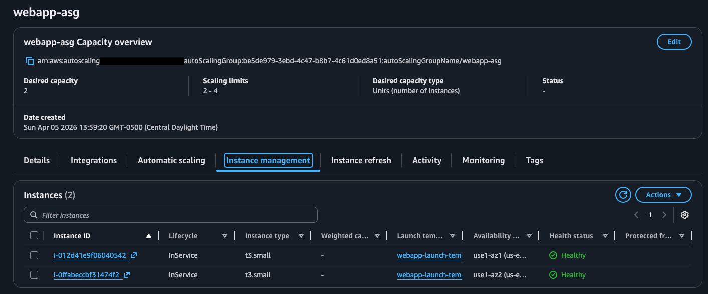

### EC2 Instances Across 2 AZs
Application instances are running in separate Availability Zones to support resilience and fault tolerance.

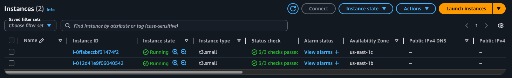

### DB Subnet Group
The database subnet group spans two private database subnets across separate Availability Zones.

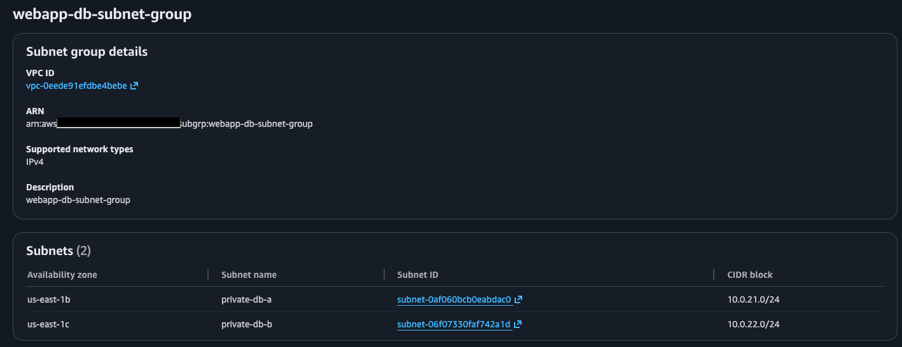

### Amazon RDS Database
The database tier runs on Amazon RDS inside the private database layer.

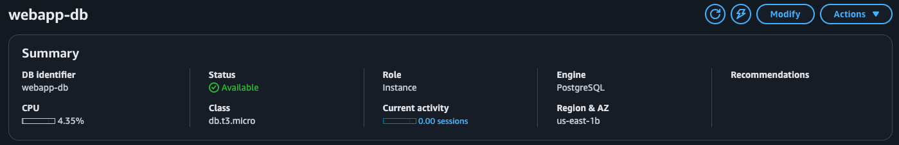

### Running Application
The application is successfully served through the Application Load Balancer and displays backend host details.

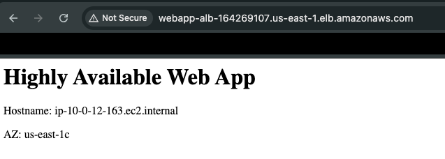

## Key Design Decisions

### 1. Public and private subnet separation
Public-facing and internal resources are separated to reflect a production-style AWS deployment. The load balancer lives in public subnets, while the application and database tiers are isolated in private subnets.

### 2. Load balancer in front of the application tier
The Application Load Balancer provides a single entry point for users and distributes traffic to healthy EC2 instances. This improves both availability and operational flexibility.

### 3. Auto Scaling across two Availability Zones
Running the application tier across two AZs reduces the risk of a single point of failure and creates a stronger high-availability design.

### 4. Private database tier
The MySQL database is not directly exposed to the internet. Access is restricted through security group rules so only the application tier can communicate with it.

### 5. NAT Gateways for outbound access
Private instances still need outbound access for updates and package installation. NAT Gateways allow this without assigning public IP addresses to the application servers.

## Skills Demonstrated

- AWS VPC design
- subnet planning and network segmentation
- route table design
- NAT Gateway architecture
- security groups and tier-to-tier access control
- Application Load Balancer configuration
- target groups and health checks
- Auto Scaling Group deployment
- EC2 launch template usage
- Amazon RDS subnet group design
- Amazon RDS Multi-AZ database deployment
- ACM certificate validation with Route 53
- CloudWatch alarm configuration
- S3 bucket hardening with encryption, versioning, and public access blocks
- IAM roles and instance profiles for EC2
- production-style cloud architecture documentation
- Infrastructure as Code with **Terraform**

## What I Learned

This project helped reinforce how AWS infrastructure components work together in a real web platform. The biggest takeaways were:

- how routing determines whether a subnet is truly public or private
- how ALB target groups and health checks affect application availability
- how Auto Scaling improves resilience beyond a fixed EC2 deployment
- how to structure a multi-tier architecture that is easier to secure and explain
- how to use Terraform to turn a console-built architecture into repeatable infrastructure
- how to document infrastructure projects in a way that is useful to hiring managers
